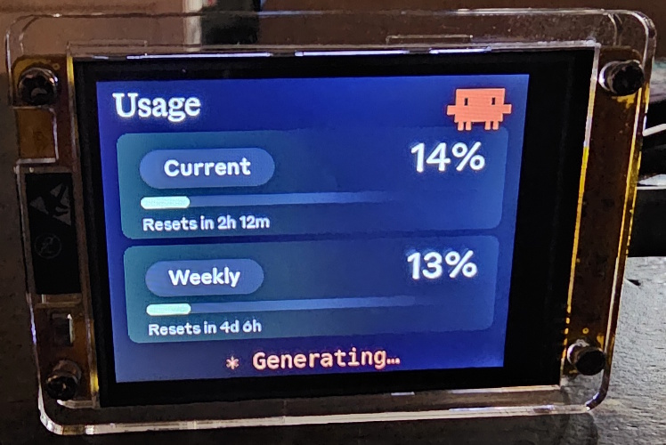
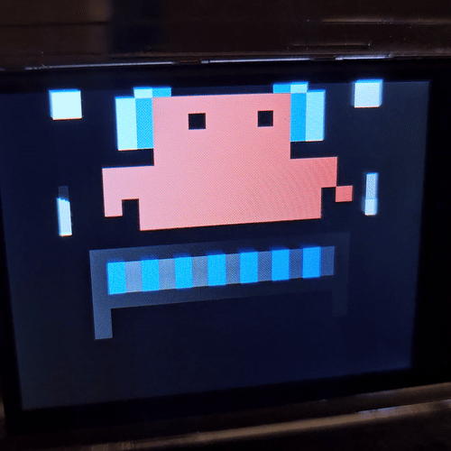

# Clawdmeter

A small ESP32 dashboard I made for my desk to keep an eye on Claude Code usage.

This is the **CYD port** — it runs on the cheap, ubiquitous AOKIN ESP32-2432S028R "CYD" board (320×240 resistive-touch TFT) and pairs with my laptop over Bluetooth. The splash screen plays pixel-art Clawd animations that get busier when your usage rate climbs.

|              Usage meter              |              Clawd animation screen              |
| :-----------------------------------: | :----------------------------------------------: |
|  |  |

The Clawd animations come from [claudepix](https://claudepix.vercel.app), [@amaanbuilds](https://x.com/amaanbuilds)'s library of pixel-art Clawd sprites, check it out, it's lovely.

> Forked from the upstream Clawdmeter project which targets a Waveshare ESP32-S3 AMOLED board with auto-rotation, battery, physical buttons, and BLE HID keyboard shortcuts. The CYD port drops the hardware features the board doesn't have but **keeps the BLE wire protocol** (name, UUIDs, JSON payload, even the HID service) so the upstream host daemon works against it unchanged.

## Screens

The device boots into the splash and stays there until you tap the screen, which cycles to the Usage screen. Tap again to flip between Usage and Bluetooth. Long-press on the Bluetooth screen's "Reset" zone to forget all paired hosts.

|              Splash               |              Usage              |                Bluetooth                |
| :-------------------------------: | :-----------------------------: | :-------------------------------------: |
|  |  |  |
|   Splash; tap to advance          | Session and weekly utilization  |    Connection status and bond reset     |

While the splash is up, the firmware also auto-rotates animations every 20 s within the current usage-rate group, so a long stretch on the splash isn't just one Clawd on loop.

## Hardware

- **AOKIN ESP32-2432S028R "CYD"** — classic ESP32, 320×240 IPS TFT (ST7789 controller, SPI), XPT2046 resistive touch, CH340 USB-UART, no PSRAM, no battery, no physical buttons. ~$10 from various sellers.
- USB cable for flashing.

The CYD form factor ships with different display controllers depending on batch — this code targets the **ST7789** variant. If colors are wrong or rotation is off, you may have an ILI9341 board and need to swap the TFT_eSPI driver flag.

## Prerequisites

- Linux (tested on Ubuntu), Windows, or macOS
- [PlatformIO CLI](https://docs.platformio.org/en/latest/core/installation/index.html)
- Linux: `curl`, `bluetoothctl`, `busctl` (BlueZ Bluetooth stack)
- macOS: `python3` (the installer sets up a venv with `bleak` and `httpx`)
- Windows: [Python 3](https://www.python.org/downloads/) on `PATH` (tick *Add Python to PATH* in the installer; `install.bat` runs `pip install bleak httpx` for you)
- Claude Code with an active subscription
- CH340 USB-UART driver (built into modern Windows/Linux/macOS; older Windows may need it installed)

## Linux installation

### Flash the firmware

```bash
cd firmware
pio run -e cyd -t upload    # auto-detects the CH340 port (usually /dev/ttyUSB0)
```

### Pair the device

After flashing, the device advertises as "Claude Controller" (the upstream name was preserved for daemon compatibility).

```bash
# Scan for the device
bluetoothctl scan le

# When "Claude Controller" appears, pair and trust it
bluetoothctl pair F4:12:FA:C0:8F:E5    # use your device's MAC
bluetoothctl trust F4:12:FA:C0:8F:E5
```

The MAC address is shown on the Bluetooth screen — tap the screen to cycle to it.

### Install the daemon

The daemon polls your Claude usage every 60 seconds and sends it to the display over BLE.

```bash
./install.sh
systemctl --user start claude-usage-daemon
```

Check status: `systemctl --user status claude-usage-daemon`

View logs: `journalctl --user -u claude-usage-daemon -f`

## Windows installation

### Flash the firmware

```powershell
cd firmware
pio run -e cyd -t upload    # CH340 enumerates as COM3/COM4/etc.
```

### Install the daemon

The Windows daemon is the same `daemon/claude_usage_daemon.py` script the macOS port uses; `install.bat` registers it as a **Windows Task Scheduler** task named "Claude Usage Daemon" that runs at computer startup as your user (via S4U, so no password is stored) and auto-restarts every minute on failure.

**Right-click `install.bat` and choose *Run as administrator*** (elevation is required to register an S4U task). The installer will:

1. Confirm `python.exe` is on `PATH` and bail with install instructions if not.
2. `pip install --upgrade bleak httpx`.
3. Register the scheduled task pointing at `daemon\claude_usage_daemon.py` in this repo.

To start it without rebooting, or to manage it later:

```powershell
schtasks /Run    /TN "Claude Usage Daemon"   # start now
schtasks /Query  /TN "Claude Usage Daemon" /V /FO LIST   # status
schtasks /End    /TN "Claude Usage Daemon"   # stop
schtasks /Delete /TN "Claude Usage Daemon" /F   # uninstall
```

Live history is in **Task Scheduler → Task Scheduler Library → Claude Usage Daemon → History**.

## macOS installation

The macOS host pieces — Python daemon, LaunchAgent, and flash helper — were ported by [Chris Davidson (@lorddavidson)](https://github.com/lorddavidson) for the original Waveshare hardware. The Python daemon's BLE wire protocol is unchanged, so it should work against the CYD; the `flash-mac.sh` script may need its USB pattern updated from `cu.usbmodem*` to `cu.wchusbserial*` (CH340).

### Flash the firmware

```bash
./flash-mac.sh                          # auto-detects USB serial
./flash-mac.sh /dev/cu.wchusbserial140  # or pass an explicit port (CH340 typically appears as cu.wchusbserial*)
```

### Pair the device

After flashing, open **System Settings → Bluetooth** and click *Connect* next to "Claude Controller". The daemon will discover it on its next scan (~30 s).

### Install the daemon

```bash
./install-mac.sh
```

See the original installer notes for LaunchAgent management:

```bash
launchctl list | grep claude-usage                                          # check it's running
tail -F ~/Library/Logs/claude-usage-daemon.out.log                          # live logs
launchctl unload ~/Library/LaunchAgents/com.user.claude-usage-daemon.plist  # stop
launchctl load -w ~/Library/LaunchAgents/com.user.claude-usage-daemon.plist # start
```

## How it works

1. The daemon reads your Claude Code OAuth token from `~/.claude/.credentials.json`.
2. It makes a minimal API call to `api.anthropic.com/v1/messages` — one token of Haiku, basically free.
3. The usage numbers come straight out of the response headers (`anthropic-ratelimit-unified-5h-utilization` and friends).
4. The daemon connects to the ESP32 over BLE and writes a JSON payload to the GATT RX characteristic.
5. The firmware parses it and updates the LVGL dashboard.
6. The firmware also tracks the rate of change of session % over a 5-minute window and picks splash animations from the matching mood group.

## Input

The CYD has no physical buttons, so all interaction is through the resistive touchscreen:

- **Tap** anywhere on the splash → advance to Usage.
- **Tap** anywhere on Usage or Bluetooth (outside the reset zone) → cycle between them.
- **Long-press** (≥1.5 s) on the Bluetooth screen's "Reset" zone → forget all paired hosts.
- **Long-press** on the splash → cycle to the next animation.

The BLE HID keyboard service from the upstream firmware is still advertised and functional — it's just unused right now since there are no buttons to send keypresses from. A future revision could add capacitive zones or external buttons that drive it.

## BLE protocol

The device advertises a custom GATT service alongside the standard HID keyboard service:

|                            | UUID                                   |
| -------------------------- | -------------------------------------- |
| **Data Service**           | `4c41555a-4465-7669-6365-000000000001` |
| RX Characteristic (write)  | `4c41555a-4465-7669-6365-000000000002` |
| TX Characteristic (notify) | `4c41555a-4465-7669-6365-000000000003` |
| REQ Characteristic         | `4c41555a-4465-7669-6365-000000000004` |
| **HID Service**            | `00001812-0000-1000-8000-00805f9b34fb` |

JSON payload format (written to RX):

```json
{ "s": 45, "sr": 120, "w": 28, "wr": 7200, "st": "allowed", "ok": true }
```

Fields: `s` = session %, `sr` = session reset (minutes), `w` = weekly %, `wr` = weekly reset (minutes), `st` = status, `ok` = success flag.

## First-boot touch calibration

On first flash (or after running the `touch-cal` serial command), the firmware shows a calibration screen and asks you to tap each corner. The calibration data is persisted in NVS so subsequent boots skip it. If your taps start landing off-target, open a serial monitor at 115200 and type `touch-cal` + Enter to wipe NVS and reboot into recalibration.

## Recompiling fonts

The `firmware/src/font_*.c` files are pre-compiled LVGL bitmap fonts. The CYD build uses Tiempos 22 (titles), Styrene 12/16/28 (panel labels and numbers), and Mono 18 (percent readouts) — but the repo also keeps the larger Waveshare-era fonts (Tiempos 34/56, Styrene 20/24/48, Mono 32) since they don't cost flash when unreferenced and may be useful for forks.

```bash
npm install -g lv_font_conv
```

Generate each one (one at a time — `lv_font_conv` doesn't like loop-driven invocations) with `--no-compress` (required for LVGL 9):

```bash
# Tiempos Text (titles)
lv_font_conv --font assets/TiemposText-400-Regular.otf -r 0x20-0x7E \
  --size 22 --format lvgl --bpp 4 --no-compress \
  -o firmware/src/font_tiempos_22.c --lv-include "lvgl.h"

# Styrene B (panel labels)
for size in 12 16 28; do
  lv_font_conv --font assets/StyreneB-Regular.otf -r 0x20-0x7E \
    --size $size --format lvgl --bpp 4 --no-compress \
    -o firmware/src/font_styrene_${size}.c --lv-include "lvgl.h"
done

# DejaVu Sans Mono (percent readouts, with spinner Unicode chars)
lv_font_conv --font assets/DejaVuSansMono.ttf \
  -r 0x20-0x7E,0xB7,0x2026,0x2722,0x2733,0x2736,0x273B,0x273D \
  --size 18 --format lvgl --bpp 4 --no-compress \
  -o firmware/src/font_mono_18.c --lv-include "lvgl.h"
```

**Important:** `lv_font_conv` v1.5.3 outputs LVGL 8 format. Each generated file must be patched for LVGL 9 compatibility:

1. Remove `#if LVGL_VERSION_MAJOR >= 8` guards around `font_dsc` and the font struct
2. Remove the `.cache` field from `font_dsc`
3. Add `.release_glyph = NULL`, `.kerning = 0`, `.static_bitmap = 0` to the font struct
4. Add `.fallback = NULL`, `.user_data = NULL` to the font struct

Without these patches, fonts compile but render as invisible.

## Converting Lucide icons

The UI uses a small set of [Lucide](https://lucide.dev) icons (bluetooth + trash) converted to RGB565 / RGB565A8 C arrays for LVGL.

```bash
node tools/png_to_lvgl.js assets/icon_bluetooth_24.png icon_bluetooth_data ICON_BLUETOOTH_WIDTH ICON_BLUETOOTH_HEIGHT
```

Default tint is white (`0xFFFFFF`); Lucide PNGs ship as black-on-transparent and would render invisible against the dark UI without it. Pass `--no-tint` for pre-coloured artwork like the logo. Paste the converter output into `firmware/src/icons.h`.

## Splash animations

The animations come from [claudepix.vercel.app](https://claudepix.vercel.app),
a library of Clawd sprites. `tools/scrape_claudepix.js` evaluates the
site's JavaScript in a Node VM to pull out frame data and palettes, then
`tools/convert_to_c.js` turns everything into RGB565 C arrays and writes
`firmware/src/splash_animations.h`.

The 20×20 native frames are upscaled 12× to 240×240 and centered on the 320×240 panel; the leftover 40px columns left and right of the art are filled with each animation's palette[0] so the bars blend rather than letterboxing in black.

To re-pull (e.g. when the source library updates):

```bash
node tools/scrape_claudepix.js
node tools/convert_to_c.js
pio run -d firmware -e cyd -t upload
```

See `tools/README.md` for details.

## Credits

- Pixel-art Clawd animation by [@amaanbuilds](https://x.com/amaanbuilds), sourced from [claudepix.vercel.app](https://claudepix.vercel.app). Frame data and palettes scraped + converted by the tooling in `tools/`.
- Lucide icon set ([lucide.dev](https://lucide.dev), MIT) for the UI glyphs.
- Anthropic brand fonts (Tiempos Text, Styrene B) — see licensing warning below.
- CYD port rebuilt by [@rprouse](https://github.com/rprouse) on top of the upstream Clawdmeter codebase.

## Licensing gray area warning

The software in this repository uses and adheres to the Anthropic brand guidelines and uses the same proprietary fonts that Anthropic has a license for but this software uses without permission as well as using assets from Anthropic such as the copyrighted Clawd mascot so even though the code in this repo is non-proprietary I will not license it myself under a copyleft license since this repo includes proprietary fonts and copyrighted assets. Please be aware of this if you fork or copy the code from this repo. **You have been warned!**
